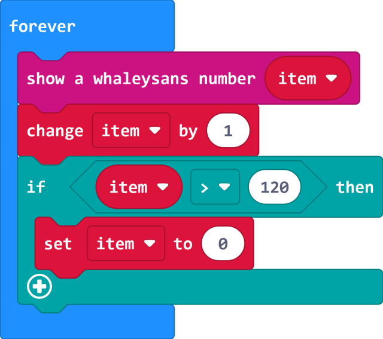

# WhaleySans Font

makecode WhaleySans Font extension for micro:bit

WhaleySans Font is a very small font (2 x 5), may show two digital in 5 x 5 LEDs.  

WhaleySans Font is from [whaleygeek/mb_clock](https://github.com/whaleygeek/mb_clock).

Author: shaoziyang  
Date:   2018.Mar  

  
  

## Add extension

open your microbit makecode project, in Add Package, paste  

https://github.com/makecode-packages/WhaleySansFont  

to search box then search.


## Basic usage

https://makecode.microbit.org/_9EaTa2E4uA9i

```
let item = 0
basic.forever(function () {
    whaleysans.showNumber(item)
    item += 1
    if (item > 120) {
        item = 0
    }
})
```

## API

- **showNumber(dat: number)**  
show a WhaleySansFont number  
dat: 0-100

## Demo

  

  

## License

MIT

Copyright (c) 2018, microbit/micropython Chinese community  

## Supported targets

* for PXT/microbit


[From microbit/micropython Chinese community](http://www.micropython.org.cn)
